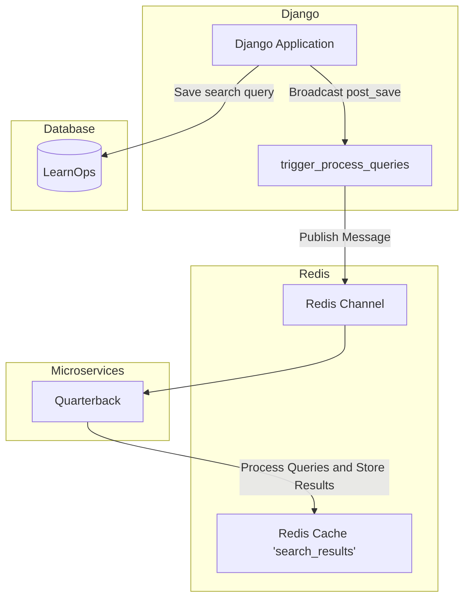

# Quarterback: NLP Service

Quarterback is a microservice designed to process user queries, extract meaningful patterns using NLP techniques, and store the results in Redis. This service listens for incoming messages on a Redis channel, processes the queries, and clusters similar sentences to identify common patterns.

## Features

- **Tokenization and Stopword Removal**: Tokenizes the queries and removes stopwords and punctuation.
- **Frequency Counting**: Identifies the most common words in the queries.
- **Sentence Pattern Extraction**: Extracts sentences containing the most common words.
- **Sentence Embeddings**: Generates embeddings for the extracted sentences using a pre-trained transformer model.
- **Clustering**: Applies DBSCAN clustering to group similar sentences.
- **Storage**: Stores the resulting unique patterns in Redis.

## Requirements

- Python 3.9+
- Redis server
- Dependencies listed in **Pipfile**

## System Architecture

- **Django Application**: When a new `RequestQuery` instance is created, a signal is triggered to publish a message to a Redis channel.
- **Redis Channel (channel_help_query)**: The Redis channel receives the message published by the Django application.
- **Microservice (Quarterback)**: The microservice listens to the Redis channel, processes the queries, and extracts meaningful patterns.
- **Redis Cache (search_results)**: The processed results are stored in the Redis cache.

The following diagram shows the flow of data from the creation of a `RequestQuery` in the Django application, through the Redis message queue, to the Quarterback microservice which processes the data and stores the results back in Redis.

